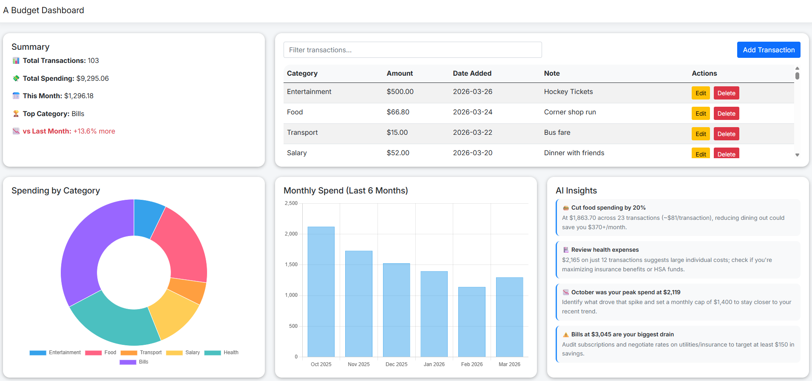
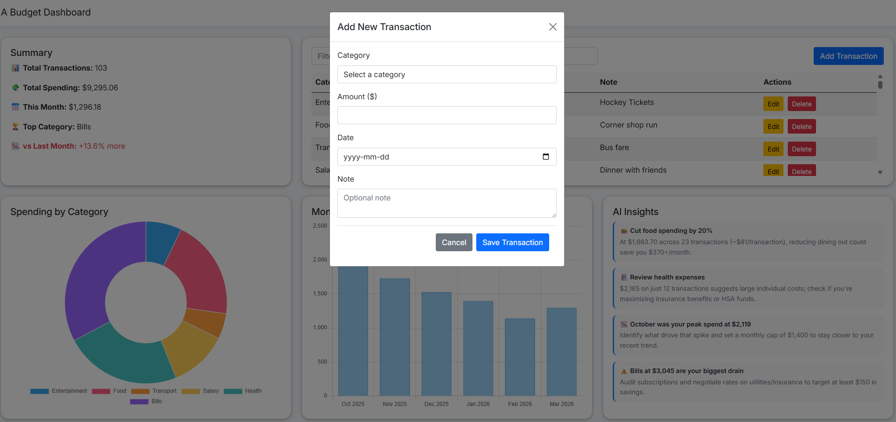

# 💰 Personal Finance Tracker

A full-stack budget dashboard built with ASP.NET Core, allowing users to track personal transactions, visualise spending by category, and monitor monthly spend trends.

---

## 📸 Screenshots

> **Dashboard Overview**
> 

> **Add Transaction Modal**
> 

---

## 🧰 Tech Stack

| Layer | Technology |
|---|---|
| Frontend | ASP.NET Core MVC (Razor Views) |
| Styling | Bootstrap 5, Custom CSS, Inter Font |
| Charts | Chart.js (CDN) |
| Backend API | ASP.NET Core Web API |
| ORM | Entity Framework Core |
| Database | SQL Server (SSMS) |
| HTTP Client | IHttpClientFactory |
| AI Insights | Anthropic Claude API |

---

## 🗂 Project Overview

The solution is split into four projects:

- **PersonalFinanceTracker.Web** — Razor MVC frontend, consumes the API via `HttpClient`
- **PersonalFinanceTracker.API** — RESTful API exposing transaction and category endpoints
- **PersonalFinanceTracker.Core** — DTOs, interfaces, and service layer
- **PersonalFinanceTracker.Data** — EF Core `DbContext`, models, and migrations

The dashboard displays:
- A **summary box** showing total transactions, total spending, this month's spend, top category, average transaction, and month-over-month comparison
- A **transactions table** with filtering, add, edit, and delete support
- A **spending by category** doughnut chart
- A **monthly spend trend** bar chart over the last 6 months
- An **AI insights box** powered by Claude, providing 3 actionable financial insights based on your spending data (cached daily)

---

## ⚙️ Setup Instructions

### Prerequisites

- [.NET 8 SDK](https://dotnet.microsoft.com/download)
- [SQL Server](https://www.microsoft.com/en-us/sql-server/sql-server-downloads) (local or remote)
- [Visual Studio 2022](https://visualstudio.microsoft.com/) or VS Code
- [Anthropic API Key](https://console.anthropic.com/)

### 1. Clone the repository

```bash
git clone https://github.com/your-username/PersonalFinanceTracker.git
cd PersonalFinanceTracker
```

### 2. Configure the database connection

In `PersonalFinanceTracker.API/appsettings.json`, update the connection string:

```json
"ConnectionStrings": {
  "DefaultConnection": "Server=localhost;Database=FinanceDB;Trusted_Connection=True;TrustServerCertificate=True;"
}
```

### 3. Configure the Anthropic API key

Create `PersonalFinanceTracker.API/appsettings.Development.json` if it doesn't exist, and add your API key:

```json
{
  "ConnectionStrings": {
    "DefaultConnection": "your-connection-string-here"
  },
  "Anthropic": {
    "ApiKey": "your-anthropic-api-key-here"
  }
}
```

### 4. Apply migrations

In the Package Manager Console (with the API project selected):

```bash
Update-Database
```

Or via CLI:

```bash
dotnet ef database update --project PersonalFinanceTracker.API
```

### 5. Set multiple startup projects

In Visual Studio:
1. Right-click the **Solution** → **Properties**
2. Set **Startup Project** to **Multiple startup projects**
3. Set both `PersonalFinanceTracker.API` and `PersonalFinanceTracker.Web` to **Start**

### 6. Run the application

Press **F5** in Visual Studio. The dashboard will be available at `https://localhost:7xxx` and the API at `https://localhost:7008/swagger`.

---

## 📁 Project Structure

```
PersonalFinanceTracker/
├── PersonalFinanceTracker.API/        # Web API project
│   ├── Controllers/
│   └── Program.cs
├── PersonalFinanceTracker.Core/       # Business logic
│   ├── Dto/
│   ├── Interfaces/
│   └── Services/
├── PersonalFinanceTracker.Data/       # Data access
│   ├── Models/
│   └── ApplicationDbContext.cs
└── PersonalFinanceTracker.Web/        # MVC frontend
    ├── Controllers/
    ├── Models/
    ├── Views/
    └── wwwroot/
```

---

## 📄 License

This project is for personal/portfolio use. © 2025 Allen Mei
